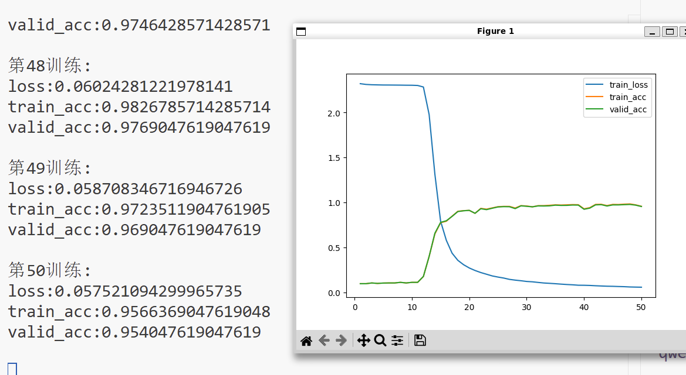

# Kaggle  

## 1.Titanic - Machine Learning from Disaster  

[Kaggle链接](https://www.kaggle.com/competitions/titanic)  

  

### 第一次尝试  

一开始使用的是仅保留几列好处理的数据，例如性别与Pclass，年龄（直接用的均值填充）。然后使用这些初步处理的数据用多层感知机和随机森林拟合，发现这种非线性特征还是随机森林拟合的好一些，有差不多0.75的得分。  

### 第二次尝试
然而，感觉这个只有十个左右维度的数据集0.75的得分有点低了，~~虽然有很多缺失值~~。  

后面觉得是数据处理太粗糙了，于是深入处理了数据，做了一些分组，头衔提取之类的特征工程。  

结果准确率并没有太大提升，最后还是多层感知机效果最好，能达到0.78将近0.79的得分。而xgboost竟然只能有0.77左右的得分。  

感觉这个数据集的质量影响了准确率，~~在排行榜上得1分的是不是都是面向外部数据拟合的~~ 😄

## 2.Digit Recognizer  

[Kaggle链接](https://www.kaggle.com/competitions/digit-recognizer)  

### LeNet  

直接复用了LeNet结构，发现拟合的很好。  

