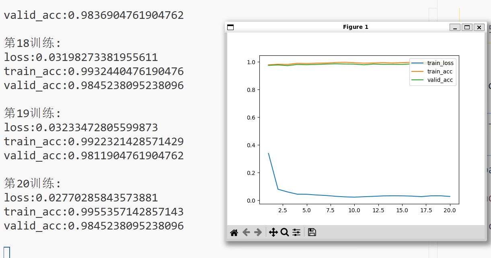
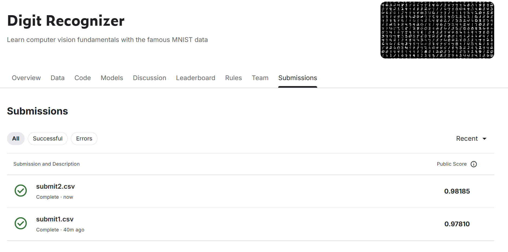
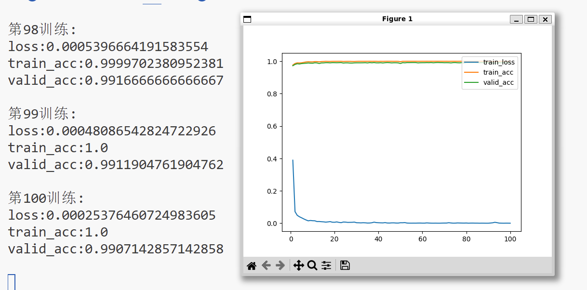
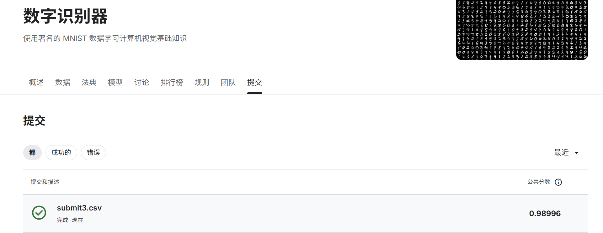
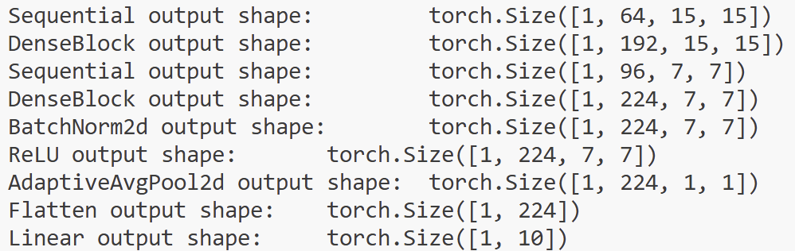
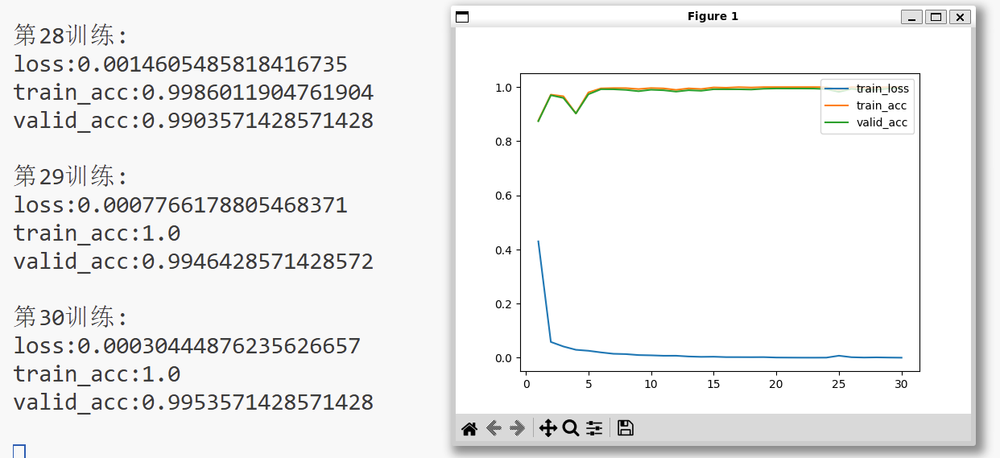
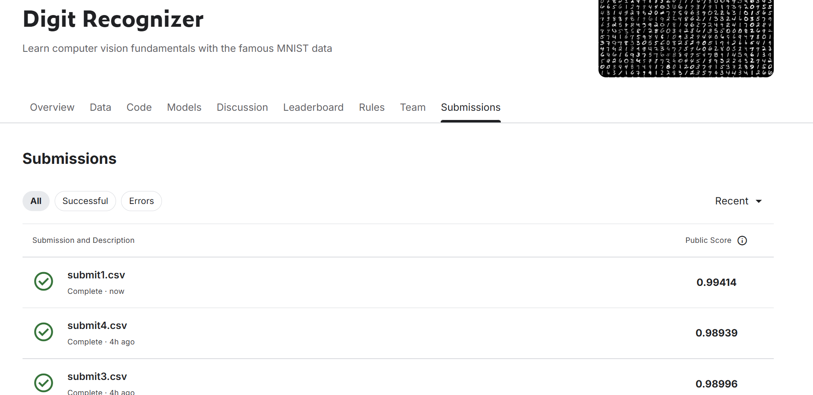

# Kaggle  

## 1.Titanic - Machine Learning from Disaster  

[Kaggle链接](https://www.kaggle.com/competitions/titanic)  

  

### 第一次尝试  

一开始使用的是仅保留几列好处理的数据，例如性别与Pclass，年龄（直接用的均值填充）。然后使用这些初步处理的数据用多层感知机和随机森林拟合，发现这种非线性特征还是随机森林拟合的好一些，有差不多0.75的得分。  

### 第二次尝试
然而，感觉这个只有十个左右维度的数据集0.75的得分有点低了，~~虽然有很多缺失值~~。  

后面觉得是数据处理太粗糙了，于是深入处理了数据，做了一些分组，头衔提取之类的特征工程。  

结果准确率并没有太大提升，最后还是多层感知机效果最好，能达到0.78将近0.79的得分。而xgboost竟然只能有0.77左右的得分。  

感觉这个数据集的质量影响了准确率，~~在排行榜上得1分的是不是都是面向外部数据拟合的~~ 😄

## 2.Digit Recognizer  

[Kaggle链接](https://www.kaggle.com/competitions/digit-recognizer)  

### LeNet  

直接复用了LeNet结构，发现拟合的很好，得分0.97。  

但是由于早期的LeNet使用的是平均池化和Sigmoid激活函数导致其收敛速度比较慢而且噪声可能更多。  

### LeNet_MR  

把AvgPool换成了MaxPool，并且激活函数使用ReLU。一开始学习率没有调整导致无法收敛，后面降低了学习率，并且选用了有动量和自适应学习率的Adam优化算法，确实收敛非常快，得分也略有提升。  

  

最后加入了一层暂退层和两层批量正则化层，使正确率接近理论最高。 

  

 

### DenseNet  

因为DenseNet对于小数据集的效果比较好，于是决定用DenseNet  

在原DenseNet的基础上进行了一些调整来使其适应(1,28,28)的MNIST，主要缩小了初始的卷积核并调整了池化层的步长。  

网络结构是这样的（以(1,1,28,28)测试）  

结果发现效果很好，经过三十轮训练在验证集上可以达到0.995的准确率  

  

后面在训练发现在验证集上最好的精度差不多就是0.995左右，于是控制出现0.995就停止训练，形成提交，得分0.994  😙

  

~~据说由于部分数字畸形模糊，现存在MNIST数据集上最优准确率为0.997~~

